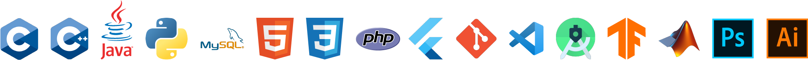

<h1 align="center">
    
</h1>

I'm an undergraduate Computer Science & Engineering student at the University of Rajshahi. I'm very passionate about Programming & love to Solve Problems.
 
Hopefully, some repositories here help you. Keep exploring & enjoy... 
----------------------------------------------------------------------------------------------------------------------------------------------------------

* 🌍  **I'm from Mymensingh, Bangladesh**
* ✉️  **You can contact me at [ahnafshahrearkhan@gmail.com](mailto:ahnafshahrearkhan@gmail.com)**
* 🚀  **I'm currently working on "Artifacts Suppression from EEG Signal using Sub-band Approach"**
* 🧠  **I'm learning Deep Learning, PHP & Laravel**
* ⚡  **I'm also very good at Graphics Designing using Adobe Illustrator**
* 🌐  **Check out my Portfolio Website [Click Here](https://ahnafshahrear.github.io/Ahnafs-Portfolio-Website)**

  

<!---  --->

<!--- Skills Section Starts -->

### 🛠 Languages, Tools & Frameworks

 
     &nbsp; 
     &nbsp; 
     &nbsp; 
     &nbsp; 
     &nbsp; 
     &nbsp; 
     &nbsp; 
     &nbsp;
     &nbsp;
     &nbsp;
     &nbsp;
     &nbsp;
     &nbsp;
     &nbsp; 
     &nbsp; 
     &nbsp;

  

<!--- Skills Section Ends -->

   

### 🔗 Let's Get Connected...

     &nbsp;
     &nbsp;

  

  
  

 

     

<!-- 
